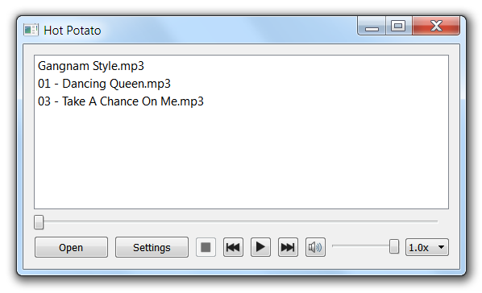

Hot Potato
------------

Hot Potato is an application that lets you play hot potato, with as few as two people involved. (Otherwise, you'd have to have someone controlling the time.)



*   Click the “Open” button to add files to your play list. Any of the typical sound files is supported (e.g., MP3).
*   Hit the play or pause buttons to start or stop the music manually.
*   Hit the stop button to stop the music and not have it restart.
*   Click the “Settings” button and you'll be prompted for a number of parameters: average play time, the pause time, etc. The defaults work pretty well.
*   _This does not work with Windows XP._
*   Hot Potato is really just the Qt example [Media Player](http://qt-project.org/doc/qt-5.0/qtmultimedia/multimediawidgets-player.html), with some extraneous features removed, and the timer added.
*   (I had an old version of Hot Potato on this site, which was based on Qt's Phonon framework, but it never worked properly on my wife's computer, and then Qt updated its multimedia interface, so I redid it entirely.)

Downloads
---------

Hot Potato is created with the [Qt application framework](https://www.qt.io/), released under the GNU Public License. That means, among other things, that you are free to download it and use it, but not to re-sell it.

Qt is a cross-platform framework, so there is the possibility for using this on Mac OS X, Linux, etc. Right now I only have Windows executables because I only have a Windows machine. Perhaps some do-gooder will build versions for other operating systems and send them to me.

I build in Windows with this, which assumes that Qt is installed and visible in your path:

```
qmake -config release
mingw32-make
```

Of course your system would have something different from “mingw32-make”—probably just “make”—if you are not building from Windows using MinGW.
